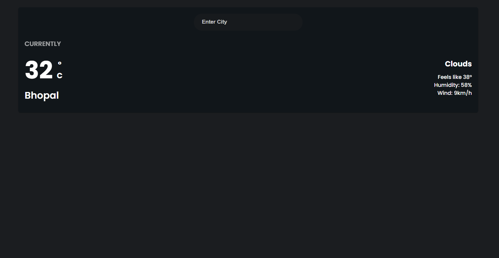

# Weather App - README

## Table of Contents

- [Introduction](#introduction)
- [Prerequisites](#prerequisites)
- [Installation](#installation)
- [Dependencies](#dependencies)
- [How to Use](#how-to-use)
- [Functionality](#functionality)

## Introduction

The "Weather App" is a React-based web application that allows users to get the current weather information of a specific city. It utilizes the OpenWeatherMap API to fetch weather data based on the user's input. The application provides details such as temperature, weather type, feels like temperature, humidity, and wind speed.



## Prerequisites

Before using the "Weather App," ensure that you have the following installed on your system:

- Node.js (version 14 or above)
- npm (Node Package Manager)

## Installation

To set up the "Weather App," follow these steps:

1. Install the package.


2. Change your current working directory to the project folder.


3. Install the required packages and dependencies using npm.


## Dependencies

The "Weather App" uses the following dependencies, which are specified in the package.json file:

- [@emotion/react](https://mui.com/material-ui/getting-started/installation/)
- [@emotion/styled](https://mui.com/material-ui/getting-started/installation/)
- [@mui/material](https://mui.com/material-ui/getting-started/installation/)
- [axios](https://www.npmjs.com/package/axios)
- [react](https://www.npmjs.com/package/react)
- [react-dom](https://www.npmjs.com/package/react-dom)
- [react-scripts](https://www.npmjs.com/package/react-scripts)

## How to Use

1. Obtain an OpenWeatherMap API key:
   - Go to the [OpenWeatherMap website](https://openweathermap.org/).
   - Sign up for a free account and obtain an API key.

2. Replace "ENTER YOUR OPENWEATHER API KEY" in the GeneralWeather.js file with your API key:

```javascript
const apiKey = 'YOUR_OPENWEATHER_API_KEY';
```
1. Start the development server:
```javascript
npm start
```
2. The application should now be running on http://localhost:3000/ in your web browser.

3. In the search input field, enter the name of the city for which you want to check the weather and press the "Enter" key.

4. The application will fetch the weather data from the OpenWeatherMap API and display the current weather information for the specified city.

## Functionality
The "Weather App" provides the following functionalities:

- Fetching and displaying the current weather information for a specified city.
- Converting temperature from Kelvin to Celsius.
- Converting wind speed from meters per second to kilometers per hour.

### Note: The application uses the axios library to perform HTTP requests to the OpenWeatherMap API and the @mui/material library for styling components.

Please ensure that you have a stable internet connection while using the app, as it relies on external APIs to fetch weather data.

### Congratulations! You have successfully set up and used the "Weather App." Enjoy exploring the current weather information for different cities!